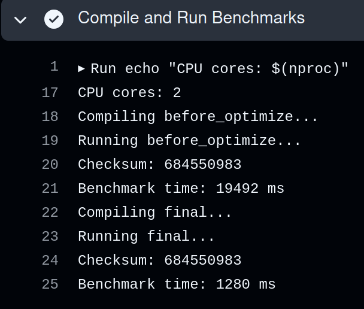
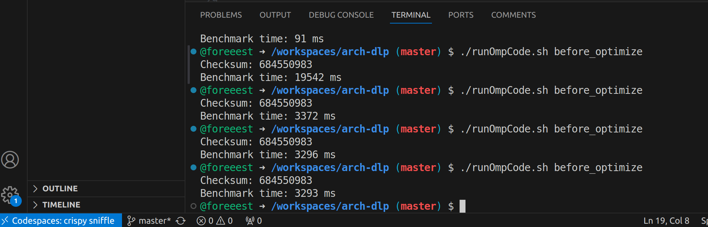
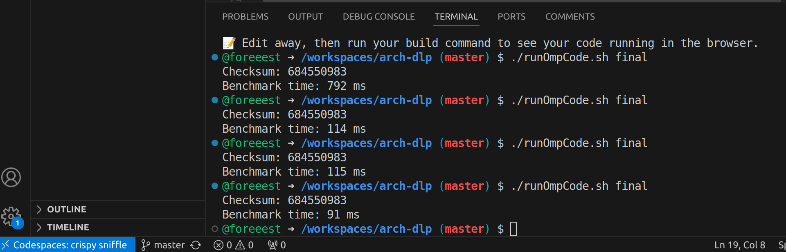

# 硬件加速C++图像处理

## 概要
我采用LUT、访存优化、simd、OpenMP等方法优化高斯滤波和幂次变换两个图像处理算法，在本地4线程环境达到超过40倍的优化效果，在github codespace4核配置下达到25倍优化效果。接下来我将详细描述各个子优化带来的效果。

## 优化思路

原始代码的两个图像操作：高斯滤波和幂次变换约各5800ms，我对它进行了逐步优化。  

### cache与局部性

我们知道cache的读取数据时间可能比直接访问内存的Latency要低1-2个数量级，因此它的命中率非常关键。Instruction Cache我们不好定向优化，但是Data Cache我们可以利用**局部性原理**来提升命中率。连续的访存可以让访存更容易被cache policy(PreFatching)所捕捉，进而有更高的命中率。  

通过简单的输出试验，我们可以发现vector特别是二维vector的存储不连续，我们写一个3x3的二维矩阵然后打印地址
```txt
v_2:0x55555556def0 a_2:0x7fffffffd4a0
v_2:0x55555556def4 a_2:0x7fffffffd4a4
v_2:0x55555556def8 a_2:0x7fffffffd4a8
v_2:0x55555556df10 a_2:0x7fffffffd4ac
v_2:0x55555556df14 a_2:0x7fffffffd4b0
v_2:0x55555556df18 a_2:0x7fffffffd4b4
v_2:0x55555556ded0 a_2:0x7fffffffd4b8
v_2:0x55555556ded4 a_2:0x7fffffffd4bc
v_2:0x55555556ded8 a_2:0x7fffffffd4c0
```
看到左边每行vector多占4个byte, 用于存储其数据结构的meta data，而普通数组完全连续。  
于是我做出了我的第一个优化，把所有vector切换为了一维数组，这让我的程序加速了约3倍  
  
```cpp
unsigned char* figure;
unsigned char* result;
```
  
二维vector | 一维vector | 二维数组  | 一维数组
----------|----------|     ------| ---------  
11500ms   | 6800ms   | 3200ms    | 3300ms  

一维数组这种简单的结构，在后续调用位数不一的simd指令还能规避一些隐蔽的bug。  
另外，我尝试过在cache这方面进一步定向优化，但因为影响因素较多暂未做出特别的优化。譬如我尝试对比了行优先和列优先的写法结果却差异不大，我尝试块化优化也没有取得大的突破。推测是现代处理器的多级cache及其采用的策略本身具有较强的适应性。    

### 技巧优化

这部分优化利用了各种巧妙手段缩短程序执行时间。  
首先是**Look Up Table**技术，我们可以通过预先计算256种像素的运算结果，将一个复杂的运算转化为一次查表。这个优化使我的幂次变换运算从约5800ms缩减到2000ms。LUT的查表操作是可以SIMD化的，尽管指令集的限制为这带来了一点点挑战。    

```cpp
for (int i = 0; i < 256; ++i) {
    gammaLUT[i] = static_cast<unsigned int>(
        255.0f * std::pow(i / 255.0f, gamma) + 0.5f);
}
```

另一个是对高斯滤波的著名的**分离巻积**，即二维巻积与一维分别巻积等效，我们无需进行数学推导就可以通过代码来验证这种等效性，两次1x3的巻积实际上就能得到原来3x3的效果
```cpp
for (size_t i = 1; i < size - 1; ++i) { // 水平方向卷积
    for (size_t j = 1; j < size - 1; ++j) {
        temp[i * size + j] = (
            figure[i * size + (j - 1)] +
            2 * figure[i * size + j] +
            figure[i * size + (j + 1)]
        ) / 4;
    }
}
for (size_t i = 1; i < size - 1; ++i) { // 水平方向卷积
    for (size_t j = 1; j < size - 1; ++j) {
        result[i * size + j] = (
            temp[(i - 1) * size + j] +
            2 * temp[i * size + j] +
            temp[(i + 1) * size + j]
        ) / 4;
    }
}
```
我们可以直观地算出它的加速比
$$ \frac{二维运算量}{分离巻积运算量} = \frac{n^{2}\times m^{2}}{n^{2}\times 2m} = \frac{m}{2}$$  
在巻积核足够大时，加速效果是可观的。但在我们3x3的前提下，理论加速比只有**1.5**，实际加速效果不是很明显。我本地测试二维巻积用时约1700ms，而水平竖直方向都是约800ms(似乎没有让cache更容易命中)。后面协同simd也没有取得很好的优化，所以没有放在最终版本的代码里。

还有一些细节上的处理需要做一些说明，**数据对齐**操作让访存函数如`_mm256_i32gather_epi32`更高效    
```cpp
alignas(32) unsigned int lutAligned[256];
```

这里有两个细节上的小小优化。联想多项式计算的秦九韶算法思想：通过**运算顺序调换**可以减少运算次数，直接采取朴素的方法每个像素乘以权值再相加是8次加法、5次乘法，像以下代码片段将能一起乘的放一起会减少至2次乘法(加法的次数是恒定的)；这里还采用**移位操作**替换昂贵的乘除来加速，因为运算数恰好是 $ 2^{n} $ 倍数。simd指令实际上成为了整个程序的主要耗时部分，因此这些优化还是会带来小幅度的加速。  
```cpp
__m256i weighted_sum = _mm256_add_epi16(
                _mm256_add_epi16(
                    _mm256_add_epi16(row1_left_16, row1_right_16),
                    _mm256_add_epi16(row3_left_16, row3_right_16)
                ),
                _mm256_slli_epi16(
                    _mm256_add_epi16(
                        _mm256_add_epi16(row2_left_16, row2_right_16),
                        _mm256_add_epi16(row1_mid_16, row3_mid_16)
                    ),
                    1
                )
            );
weighted_sum = _mm256_add_epi16(weighted_sum, _mm256_slli_epi16(row2_mid_16, 2));
```

还有一个细节是simd的**操作余数**，譬如我高斯滤波采用的16步长处理中心区域会产生一个14x16384的"余数区域"，但这加上四边四角的数量级都只是中心区域的 $ \frac{1}{1000} $ ，所以我直接原封不动用最朴素的C++来完成这部分代码，保证逻辑的正确性。

### simd

一开始读到AVX2给予的256bit并行运算支持时我非常高兴，因为 $ \frac{256}{8} = 32 $ (我离40倍不远了)，但是AVX2提供的接口会存在**瓶颈**，最终我高斯滤波和幂次变换的**步长**只分别采用了16和8。同时为了兼容github action和codespace，我只使用AVX2和SSE指令，无法通过AVX512来进一步提高并行度。 

对于高斯滤波来说，它因为加乘操作会溢出255，所以必须用16bit的数承载运算，步长也就限制在了 $ \frac{256}{16} = 16 $ ；而幂次变换乍一看似乎可以32路并行，但查表接口`_mm256_i32gather_epi32`系列无论如何都要求index在32bit，因此步长就限制在了 $ \frac{256}{32} = 8 $ 。

simd对我来说性能提升是飞跃式的，在步长有限和类型转换等限制下仍然快了约**3倍**(一开始写的幂次变换直接以32为步长快了约8倍，可惜逻辑不正确)  

写出来的程序再回看很简单，但是没写出来之前查询适合的接口还是有一点点tricky。一个问题就是幂次变换中32bit压缩回8bit的简易接口`_mm256_cvtepi32_epi8`只在AVX512支持，实际上所有`cvtepi32`系列都只在AVX512支持。因此我只能通过两次`packus`操作来压缩  
```cpp
__m128i lutData16  = _mm_packus_epi32(_mm256_extracti128_si256(lutData, 0),_mm256_extracti128_si256(lutData, 1));
__m128i lutData8 = _mm_packus_epi16(lutData16, zeroVec);
```

而`packus`必须要留意到官方文档中的**Saturate**不同于`cvtepi32`的**Truncate**，它会在高精度数大于低精度数最大值时取0xFF....，在小于0时取0，这意味着我们不仅仅要保证那8bit的数运算正确，还需要保证高32bit不要被意想不到的东西污染。这是我LUT大手大脚地采用32bit`unsigned int`的原因，因为要防止`_mm256_i32gather_epi32`在高位读入"污染数据"，这也是用一维数组相较于vector的优势，否则可能读入vector的meta data造成诡异的运算错误    

### OpenMP

我的最后一个加速点是多线程、多进程，我选择了简单而高效的OpenMP。我设置了与期望核心数目相当的线程数，因为这样能达到较高性能，并在循环加上OpenMP的调用  
```cpp
omp_set_num_threads(4);
#pragma omp parallel for
```
在高斯滤波和幂次变换中，我们基本上不需要处理不同循环轮数之间的数据依赖或者可能带来的竞态，我们可以放心地使用OpenMP让它来调度分配循环。但是要注意在OpenMP的使用下，我们不能再假设循环i核i+1轮之间顺序发生，因此原来无所谓的越界都要小心避免，譬如我们每次循环处理8x8=64bit数据，用`storeu_si128`虽然高64位都是0，在顺序条件下不会影响最终结果，但是乱序下会覆盖其它循环的结果，故必须要用`storeu_si64`  

OpenMP加速效果非常显著，我在本地4线程加速了将近4倍(线程数远比核心数少的时候接近线性加速)，且兼容SIMD的优化，使累计加速比来到**47.9**，但是在4核github codespace，OpenMP只加速了2倍左右，在github action的默认2核配置下OpenMP竟然几乎不起作用


## 代码运行

### 运行环境

> g++ (Ubuntu 11.4.0-1ubuntu1~22.04) 11.4.0  
> 同时需要AVX2和SSE的支持  

```shell
$ g++ -O0 -std=c++20 -m64 -mavx2 -msse4.1 -march=native -fopenmp -o "./build/$PROGRAM_NAME" "./src/$PROGRAM_NAME.cpp"
```

### 实验结果

1. **在本地上运行**  
> 环境：16核AMD Ryzen 7 8845HS、32GB内存、ubuntu-22.04

code            | performance | times   | description
----------------| ------------|---------| ------------
before_optimize | 11500ms     | 1       | 原版
LUT             | 7200ms      | 1.6     | 幂次变换5800 -> 2000
LUT + vec改数组  | 2400ms      | 4.8     | 高斯1750、幂次650
叠加OpenMP(4线程) | 620ms       | 18.5    | 高斯450、幂次170
再叠加SIMD       | 240ms       | 47.9    | 最终提交版

注：因为本身运行时间存在相对随机性，大数字向百位取整; 另外，小优化没有单独拿出来分解了   

2. **github action默认配置**  
> 环境： 2核  ubuntu-latest  



可以看到在OpenMP几乎不起作用的情况下加速比约为15倍  

3. **github codespace下的各种编译等级对比**  
> 环境： 4核 16GB内存、ubuntu-22.04  

原版与优化版；-O0至-O3  
  




这里-O0下加速约25倍  

## 总结  
本次实验我收获非常大，对硬件友好型代码有了更具体的认识！  
我的工作还不够完善，还有很多进一步优化的空间，包括：
- 其它多线(进)程工具的使用：pthread更底层、MPI是进程级别的、intelTBB可以达到比OpenMP更高的加速比
- simd代码可以写得更漂亮  
- cache特性探索  
- OpenCV源码学习更多优化技术   
- 使用性能监测工具如火焰图进一步细化分析 

<script type="text/javascript" src="http://cdn.mathjax.org/mathjax/latest/MathJax.js?config=TeX-AMS-MML_HTMLorMML"></script>
<script type="text/x-mathjax-config">
    MathJax.Hub.Config({ tex2jax: {inlineMath: [['$', '$']]}, messageStyle: "none" });
</script>